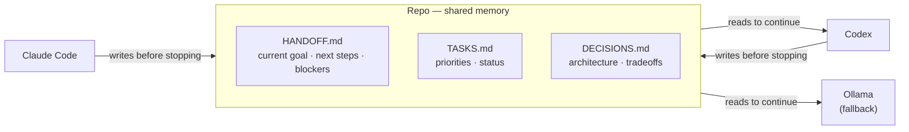
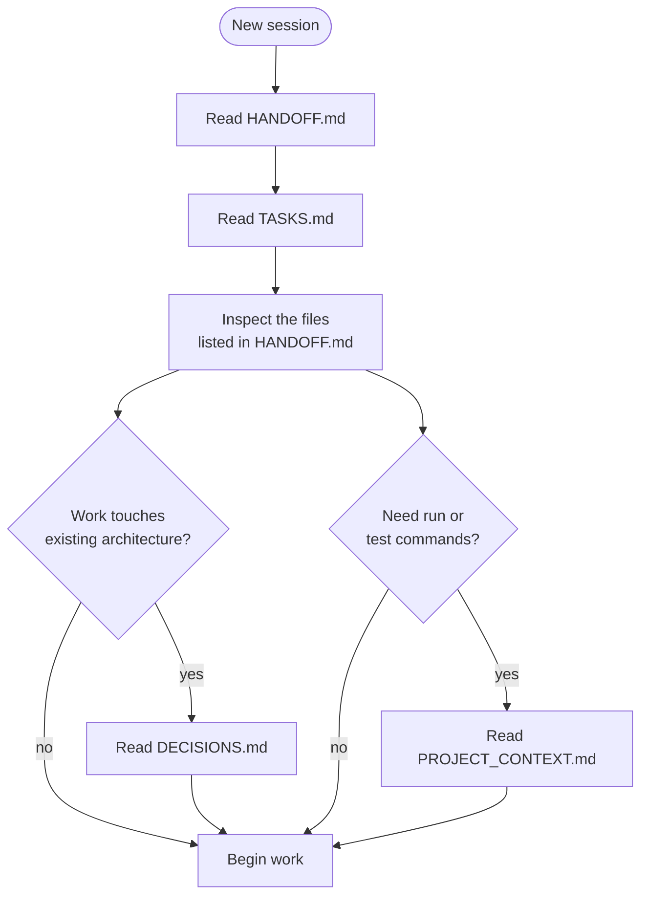
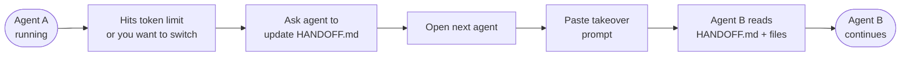
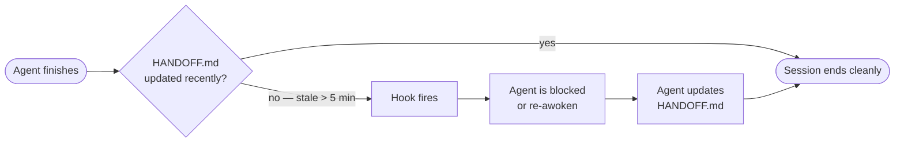

# CodeRelay

**A minimal handoff system for building software with multiple coding agents — without losing context.**

The repo is the memory. Not the conversation.

---

## The Problem

Most multi-agent workflows break down for the same reason: important context only lives inside a chat window. Once that window gets long, truncated, or hits a token limit, the next agent has to reconstruct everything from scratch.

The instinct is to fix this by writing comprehensive context files. That instinct is wrong.

> [!IMPORTANT]
> Research on coding agents found that loading agents with broad context files **reduces task success by 2–3% while increasing inference cost by over 20%**. Agents waste reasoning tokens on re-reading things they could derive directly from the code.
>
> — *[Evaluating AGENTS.md: Are Repository-Level Context Files Helpful for Coding Agents?](https://arxiv.org/abs/2602.11988) (2025)*

CodeRelay is built around this finding. It gives agents the minimum they need to continue — and nothing redundant.

---

## How the Relay Works



Each agent reads what it needs, works, and writes back before stopping. No agent depends on the previous agent's chat history.

---

## The Files

Ordered by how often an agent should read them:

| File | Read when | Contains |
|---|---|---|
| `src/HANDOFF.md` | Every session | Current goal, in-progress work, next steps, blockers |
| `src/TASKS.md` | Every session | Backlog, priorities, status |
| `src/DECISIONS.md` | Work touches architecture | Non-obvious choices and why they were made |
| `src/PROJECT_CONTEXT.md` | Need run/test commands | Commands, hard constraints, external deps only |
| `src/TAKEOVER_PROMPTS.md` | Switching agents | Copy-paste prompts for each agent |
| `src/SESSION_CHECKLIST.md` | Starting or ending a session | Repeatable ritual for clean handoffs |

---

## How Agents Load Context

Loading everything upfront is the pattern the research shows hurts performance. Agents should load in order of value and stop when they have enough to act.



> [!TIP]
> If an agent could derive it by reading the code or running `git log`, it does not belong in a context file.

---

## Quick Start

**1. Install into your project**

```sh
git clone https://github.com/yourname/coderelay
./coderelay/setup.sh /path/to/your/project
```

Pass `--force` to overwrite files that already exist.

**2. Fill in PROJECT_CONTEXT.md**

Add only your run/test/build commands, hard constraints, and external dependencies. Leave out anything the agent can read from the code — app descriptions, stack details, user flows. That information adds cost and reduces accuracy.

**3. Work as normal**

Use Claude Code, Codex, or a local model as usual. End every session by updating `src/HANDOFF.md`.

**4. Switch agents**

Paste the takeover prompt from `src/TAKEOVER_PROMPTS.md` into the next agent. It will read `HANDOFF.md`, inspect the listed files, and continue without needing the chat history.

---

## Switching Agents



Works for any combination — Codex → Claude Code, Claude Code → Codex, or either → local Ollama.

---

## Automatic Handoff Hooks

CodeRelay ships with stop hooks for both Claude Code and Codex. If an agent tries to end a session without updating `HANDOFF.md`, the hook intervenes.



**Claude Code** — `asyncRewake` on the `Stop` event re-awakens Claude with a prompt to update the handoff before the session closes. Configured in `.claude/settings.json`.

**Codex** — A shell script runs on the `Stop` event and returns `decision: block` if the handoff is stale. Configured in `.codex/hooks.json`.

Both hooks are installed automatically by `setup.sh`. Restart Claude Code (or open `/hooks`) after setup to activate the Claude hook.

---

## What Belongs in Each File

The research is clear: redundancy is the failure mode. If information already exists in the code, adding it to a context file makes agents slower and less accurate.

| File | Write this | Not this |
|---|---|---|
| `HANDOFF.md` | Current goal, next steps, blockers | What you just did — use `git log` |
| `PROJECT_CONTEXT.md` | Commands, constraints, external deps | App description, stack, user flows |
| `DECISIONS.md` | Non-obvious tradeoffs and why | Obvious implementation details |
| `TASKS.md` | Status and priority | Implementation notes |

---

## Local Fallback With Ollama

If both hosted agents are unavailable or out of tokens, a local Ollama model (Qwen Coder recommended) can continue the work without the prior chat transcript.

Give it:
- `src/HANDOFF.md`
- `src/TASKS.md`
- `src/DECISIONS.md` (only if the next step touches architecture)

Then tell it to inspect the files listed in `HANDOFF.md`, continue the current goal, and update `HANDOFF.md` before stopping.

---

## Repo Structure

```
coderelay/
├── setup.sh                           # Installs CodeRelay into a target repo
└── src/
    ├── .claude/
    │   └── settings.json              # Claude Code stop hook (asyncRewake)
    ├── .codex/
    │   ├── config.toml                # Enables Codex hooks feature
    │   ├── hooks.json                 # Codex stop hook config
    │   └── hooks/
    │       └── stop_handoff_check.sh  # Handoff freshness check
    ├── HANDOFF.md
    ├── TASKS.md
    ├── DECISIONS.md
    ├── PROJECT_CONTEXT.md
    ├── TAKEOVER_PROMPTS.md
    └── SESSION_CHECKLIST.md
```

`setup.sh` copies the `src/` Markdown files to `target/src/` and installs `.claude/` and `.codex/` at the target repo root where each agent expects them.

---

## The One Rule

**Every session ends with a handoff.**

If an agent stops without updating `HANDOFF.md`, the next agent will waste time rediscovering context. The hooks exist to enforce this, but the habit matters more than the tooling.

A good handoff answers five questions and nothing else:

1. What is the current goal?
2. What is still in progress?
3. What are the next 3 concrete steps?
4. Which files matter most right now?
5. Any bugs, blockers, or risks?

What you just completed belongs in `git log`, not the handoff.

---

## Best Practices

- Load context in order: `HANDOFF.md` → `TASKS.md` → specific files → `DECISIONS.md` only if needed
- Keep `HANDOFF.md` under a page — if it is getting long, it is doing too much
- Write `DECISIONS.md` entries while the reasoning is fresh, not after the fact
- Prefer small, reviewable changes over sprawling edits across sessions
- Treat tests, lint, and repo state as shared truth — not just the context files
